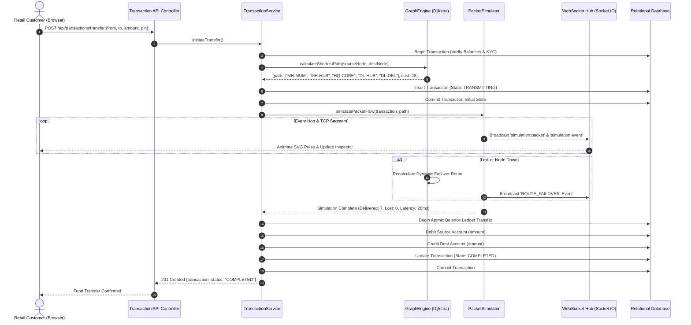

# NETBANKX — System Architecture & Design Specification

## 1. Architectural Philosophy & Layering

NETBANKX is engineered according to **Clean Architecture** principles, maintaining strict separation of concerns between core banking domain logic, network graph routing, discrete-event packet simulation, persistence, and real-time visualization.

```
+------------------------------------------------------------------------+
¦                        PRESENTATION LAYER                              ¦
¦   React 18 SPA (Vite, TypeScript, Tailwind CSS, Lucide, SVG Graph)    ¦
+------------------------------------------------------------------------+
                                    ¦ HTTP REST / WebSocket JSON
+-----------------------------------?------------------------------------+
¦                        API & CONTROLLERS LAYER                         ¦
¦   AuthController, AccountController, TransactionController,           ¦
¦   NetworkController, AuditController, WebSocket Manager                ¦
+------------------------------------------------------------------------¦
¦                       DOMAIN SERVICES LAYER                            ¦
¦   • Core Banking: AuthService, AccountService, TransactionService      ¦
¦   • Network Twin: GraphEngine, PacketSimulator, TelemetryAggregator    ¦
¦   • Governance:   AuditService, RBAC Middleware                        ¦
+------------------------------------------------------------------------¦
¦                    DATA ACCESS & PERSISTENCE LAYER                     ¦
¦   • MySQL 8.0 Connection Pool (InnoDB, Row-Level Locking)              ¦
¦   • Embedded Transactional In-Memory Relational Engine (ACID Fallback) ¦
¦   • In-Memory Network Graph (Weighted Adjacency List)                  ¦
+------------------------------------------------------------------------+
```

---

## 2. Core Subsystems

### A. Core Banking Subsystem
- **Double-Entry Ledger Integrity:** Every fund transfer credits one verified account and debits another within a single atomic database transaction.
- **Financial Precision:** Strict `DECIMAL(15,2)` representation throughout the database, service layer, and API contracts prevents IEEE 754 floating-point inaccuracies.
- **State Machine:** Transactions progress monotonically through explicit states:
  $$\text{PENDING} \longrightarrow \text{TRANSMITTING} \longrightarrow \text{COMPLETED} \quad (\text{or } \text{FAILED})$$

### B. Network Graph Engine (Dijkstra Routing Subsystem)
- Represents the national banking network as a directed, weighted graph $G = (V, E)$.
- Vertices ($V$) represent enterprise routers:
  - `HQ_CORE`: National Datacenter core routing engine (AS-65000).
  - `REGIONAL_HUB`: Regional aggregation gateways (`MH-HUB`, `DL-HUB`, `KA-HUB`).
  - `BRANCH_ROUTER`: Retail branch edge routers (`MH-MUM-001`, `DL-DEL-001`, etc.).
  - `CUSTOMER_EDGE`: End-user mobile/web client endpoints.
- Edges ($E$) represent dedicated Optical Fiber (OFC) and leased enterprise WAN links.
- Uses **Dijkstra's Algorithm** with priority queues to dynamically calculate lowest-cost paths based on active link metrics.

### C. Educational Packet Simulator (L2–L7 Discrete Events)
- Whenever a transaction is initiated, the simulator decomposes the transaction into discrete simulated packets:
  1. `TCP_SYN` (Layer 4 Connection Initiation)
  2. `TCP_SYN_ACK` (Layer 4 Gateway Response)
  3. `TCP_ACK` (Layer 4 3-Way Handshake Completion)
  4. `BANKING_TXN_DATA` (Layer 7 Encrypted Payload)
  5. `BANKING_ACK` (Layer 7 Ledger Confirmation)
  6. `TCP_FIN` (Layer 4 Graceful Teardown)
- Features simulated Layer 2 ARP MAC address rewriting per hop, Layer 3 TTL decrementing, and TCP sequence/acknowledgement number tracking.
- Features a **retransmission engine**: packets encountering link degradation or loss trigger automated timeout backoff and selective retransmission (`[RTX]`).

### D. Real-Time Telemetry & WebSocket Dispatcher
- Leverages Socket.IO rooms to broadcast granular simulation events:
  - `simulation:packet` — Emitted per hop for live SVG animation.
  - `simulation:event` — Emitted to log state changes in the event journal.
  - `topology:updated` — Broadcast when nodes or links are severed/restored.
  - `metrics:updated` — Real-time telemetry (RTT, throughput, loss %, packet counters).

---

## 3. Transaction Execution & Failover Sequence Flow



---

## 4. Multi-Tenant Role-Based Access Control (RBAC)

| Role | Scope & Permissions | Accessible Endpoints & Views |
| :--- | :--- | :--- |
| **`CUSTOMER`** | Own accounts, transactions, and service tickets. | `/customer/dashboard`, `/customer/transfer`, `/customer/history`, `/customer/requests` |
| **`BRANCH_STAFF`** | Retail accounts & router metrics within assigned branch. | `/branch/dashboard`, `/branch/customers`, `/branch/transactions`, `/branch/network` |
| **`REGIONAL_MANAGER`** | Aggregated branch operations across regional hub. | `/regional/dashboard`, `/regional/branches`, `/regional/transactions`, `/regional/network` |
| **`HQ_ADMIN`** | Full national WAN digital twin, lab fault-injection, all ledgers. | `/hq/dashboard`, `/hq/network-lab`, `/hq/branches`, `/hq/transactions`, `/hq/audit-logs` |

---

## 5. Reliability & Concurrency Guarantees

1. **Deterministic State Synchronization:** In-memory graph states and persistent database records are synchronized upon link/node state change events.
2. **Double-Spend Prevention:** Account balances are verified with row-level locks before debiting; overdrawing is strictly prevented at both the application and database constraint levels.
3. **Graceful Degradation:** If the primary MySQL database connection is interrupted or unconfigured, the backend automatically transitions to its embedded transaction-compliant relational engine without restarting or failing client requests.
