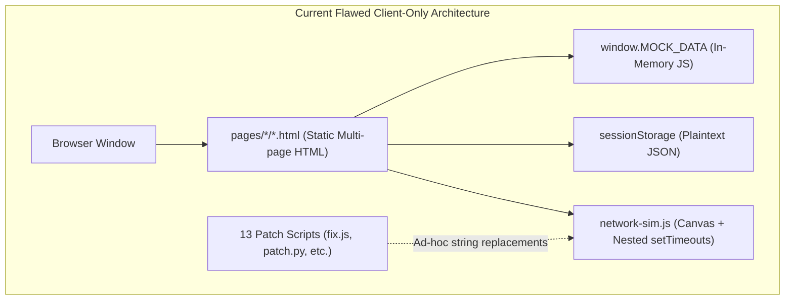
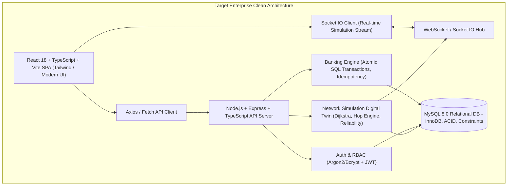

# NETBANKX — Comprehensive Architecture & Security Audit Report

**Project Title:** NETBANKX — Enterprise Banking Network Digital Twin & Real-Time Network Simulation Platform  
**Audit Date:** September 2026  
**Auditor:** Senior Full-Stack, Security, Networks & QA Lead  
**Assessment Target:** Entire Codebase (`/`, `/js`, `/css`, `/pages`, and all patch artifacts)

---

## 1. Executive Summary & Stack Assessment

The repository was conceived as an educational web platform to demonstrate multi-tier banking operations coupled with computer networking principles (OSI 7-layer model, packet routing, ARP/MAC rewriting, NAT, TCP handshakes, TLS). 

However, upon complete static analysis of all 54 files in the repository, the current implementation is **100% client-side static HTML/CSS and vanilla JavaScript**.

### Stack Breakdown
| Component | Claimed / Intended | Actual Status in Repository |
| :--- | :--- | :--- |
| **Backend Runtime** | Node.js / Express / TypeScript | **Non-existent**. No server exists. No `package.json`, no Node server entry point. |
| **Database** | MySQL / Relational DB | **Non-existent**. All "records" are stored in an in-memory JS object (`window.MOCK_DATA`) in `js/mock-data.js`. |
| **API Layer** | REST APIs / WebSockets | **Non-existent**. No network requests (`fetch`/`XMLHttpRequest`/`WebSocket`) are made to any real backend. |
| **Frontend Framework** | Modern Component Architecture | Vanilla JS DOM manipulation spread across individual multi-page `.html` files with inline `<script>` tags. |
| **Authentication** | Secure JWT/Session + Bcrypt | Plaintext string comparison in `sessionStorage` (`js/auth.js`). Frontend role checks easily bypassed. |
| **Network Engine** | Independent graph simulation | DOM-coupled Canvas script (`js/network-sim.js`) with nested `setTimeout` callbacks, mutated by 13 monkey-patch scripts. |
| **Patch Scripts** | Clean architecture | **13 patch and regex-replacement scripts** (`fix.js`, `branch_patch.js`, `direct_patch.js`, `force_interstate.js`, etc.) modifying files ad-hoc. |

---

## 2. Current Architecture vs Target Architecture

---

## 3. Detailed Component Audit

### 3.1 Backend & Database
* **Absence of Backend**: There is no Node.js backend running in the repo. When a user logs in or executes a transfer, execution never leaves the browser tab.
* **Absence of MySQL**: There are zero SQL schemas, zero migration files, and zero database connectors (`mysql2`, `typeorm`, `prisma`, `knex`).
* **Mock Data Fallacy (`js/mock-data.js`)**:
  * 1 HQ admin, 3 regional managers, 10 branch managers, 15 customer profiles stored in a global variable.
  * Transactions are randomly generated on browser refresh using `Math.random()`.
  * Monetary balances are plain JavaScript floating-point numbers (`balance: 125000`), violating basic financial computing principles.
  * Transfers simply decrement `session.user.balance` in memory; refreshing the page wipes all newly initiated transactions or balance updates.

### 3.2 Authentication & Authorization (`js/auth.js`)
* **Plaintext Passwords**: Passwords (`hq@2024`, `reg@2024`, `branch@2024`, `cust@2024`) are stored unhashed in `window.MOCK_DATA` and evaluated with direct equality (`u.password === password`).
* **Client-Side Authorization**: The function `requireAuth(allowedRoles)` checks `sessionStorage.getItem('nbx_session')`. Anyone can open browser DevTools and execute `sessionStorage.setItem('nbx_session', JSON.stringify({role: 'hq', user: {id: 'admin'}}))` to gain administrative access.
* **No Expiration / No Revocation**: Sessions have no cryptographic signing, no nonce, no token rotation, and no server validation.
* **No Rate Limiting**: The login form allows infinite brute-force attempts without throttle.

### 3.3 Banking Operations & State Machine
* **No Atomic Transactions**: When a transfer is submitted in `pages/customer/transfer.html`, `currentBalance -= amount` is executed inside a canvas callback. If the browser tab crashes or canvas fails, account balances become corrupted or un-synced.
* **No Concurrency Control**: No database row locking (`SELECT ... FOR UPDATE`), no double-spending protection, and no idempotency keys.
* **No Real Ledger / Event Sourcing**: Transfers do not generate double-entry ledger rows (debit entry + credit entry).
* **Missing State Machine**: Transaction states (`INITIATED`, `VALIDATING`, `ROUTING`, `TRANSMITTING`, `DELIVERED`, `COMPLETED`, `FAILED`, `ROLLED_BACK`) exist only as visual string logs in the DOM rather than an authoritative backend state machine.

### 3.4 Network Simulation Engine (`js/network-sim.js`)
* **DOM & Canvas Coupling**: `network-sim.js` directly queries DOM elements (`document.getElementById('networkLog')`, `document.getElementById('speedToggle')`, injects `<style>` tags directly into `document.head`).
* **No Real Routing Algorithm**: Routes are not dynamically computed with Dijkstra or Bellman-Ford on a weighted graph. Paths are hardcoded static sequences (e.g. `['HQ', 'MH-HUB', 'MH-MUM-001-RT']` or fixed 7-hop arrays `['CUST1','BR1','HUB1','HQ','HUB2','BR2','CUST2']`).
* **Timer Hell & Race Conditions**: Packets are animated via deeply nested `setTimeout` callbacks (callback pyramid up to 8 levels deep). If a user rapidly clicks "Transfer" or changes pages mid-flight, orphaned timers continue firing and throwing `Cannot read properties of null` errors.
* **Fake TCP Handshake**: TCP SYN / SYN-ACK / ACK are simulated via chained `setTimeout` animations with pre-cooked timestamps rather than simulating a connection state machine with Sequence/Ack tracking, sliding windows, and timeout retransmissions.
* **Fake Packet Loss & Metrics**: Packet loss is simulated by a simple `Math.random() < packetLoss` check that merely prints a log and skips to the next hardcoded step, rather than simulating packet buffer queues, link drop probabilities, and transport layer retransmission.

### 3.5 OSI Trace Layer (`js/osi-trace.js`)
* Hardcodes mock MAC addresses, mock TCP ports, mock TTLs (64, 63, 62...), and static JSON payloads per hop.
* Does not parse real PDU byte buffers or real protocol headers.
* Relies on global DOM manipulation to append HTML cards into `#osiTraceList`.

### 3.6 Multi-Page Frontend & Navigation
* There are 22 separate HTML files with duplicated navigation sidebars, headers, styling overrides, and inline scripts.
* Changing a navigation link or brand asset requires editing 22 distinct HTML files.
* Breadcrumbs and active nav highlights in `js/router.js` rely on brittle regex matching of `window.location.pathname`.

### 3.7 The "Patch Scripts" Disaster
The repository contains 13 patch scripts:
1. `branch_patch.js` (7.5 KB) — Modifies `network-sim.js` regex to insert `sendBranchToBranch`.
2. `direct_patch.js` (7.3 KB) — Injects direct HQ ping animations into `network-sim.js`.
3. `fix.js` (6.7 KB) — Regex replaces corrupted `addLog` and `animateTransfer` blocks caused by PowerShell encoding issues.
4. `force_interstate.js` (10.5 KB) — Overwrites recipient resolution logic in HTML.
5. `force_interstate_2.js` (7.0 KB) — Further regex patches for inter-state routing.
6. `force_interstate_3.js` (7.1 KB) — Third attempt to fix 7-hop route animations.
7. `interstate_patch.js` (9.1 KB) — Modifies customer transfer routing logic.
8. `patch.py` (9.3 KB) — Python script attempting regex replacement of TLS configs and logs.
9. `persist_patch.js` (7.4 KB) — Injects simulation report modal into canvas parent.
10. `sec_patch.js` (6.7 KB) — Injects rogue SQL injection attack animations.
11. `timing_patch.js` (2.6 KB) — Changes `speed: 0.04` to `speed: 0.015`.
12. `trace_patch.js` (7.9 KB) — Monkey-patches `OSITrace.addHop`.
13. `trace_patch2.js` (8.2 KB) — Further monkey-patches `OSITrace`.

These scripts represent extreme technical debt and fragile ad-hoc monkey-patching. Every script must be completely eliminated in favor of a unified, clean codebase.

---

## 4. Security Audit & Vulnerabilities

| Vulnerability | Severity | Description | Remediation |
| :--- | :--- | :--- | :--- |
| **CWE-259: Plaintext Passwords** | **CRITICAL** | Passwords stored in plaintext inside `js/mock-data.js`. | Implement Argon2id or Bcrypt with unique salts on server. |
| **CWE-306: Missing Authentication on APIs** | **CRITICAL** | No real backend or API auth exists; all actions are client-side. | JWT / Secure HTTP-only cookies with server-side validation. |
| **CWE-285: Improper Authorization / IDOR** | **CRITICAL** | Role enforcement is purely `sessionStorage` in JavaScript. | Server-side RBAC middleware (`CUSTOMER`, `BRANCH_STAFF`, `REGIONAL_MANAGER`, `HQ_ADMIN`). |
| **CWE-311: Missing Cryptographic Integrity** | **HIGH** | "TLS 1.3" is just `btoa()` Base64 encoding in the browser! | Real HTTPS in transport + genuine crypto hashing / digital signatures. |
| **CWE-79: Cross-Site Scripting (XSS)** | **HIGH** | `innerHTML` is used across `osi-trace.js`, `utils.js`, `transfer.html`, `network-sim.js` without escaping user inputs. | Use React JSX auto-escaping and sanitized rendering. |
| **CWE-362: Race Condition / Double Spending** | **HIGH** | Multiple concurrent clicks trigger simultaneous transfers without mutex or database locks. | ACID DB transactions with row-level locking (`SELECT ... FOR UPDATE`) and idempotency keys. |
| **CWE-681: Incorrect Monetary Representation** | **MEDIUM** | Uses IEEE 754 floating-point numbers (`125000.00`) causing floating-point arithmetic errors. | `DECIMAL(15, 2)` in MySQL and string/BigInt handling in backend. |

---

## 5. Networking & Simulation Audit

| Feature | Current Implementation | Flaw / Academic Inaccuracy | Correct Implementation |
| :--- | :--- | :--- | :--- |
| **Topology Graph** | Hardcoded visual coordinates in Canvas. | Graph topology is not modeled as nodes and weighted edges. | Graph adjacency matrix / list with dynamic nodes, links, capacities, latency, loss. |
| **Routing Algorithm** | Fixed array indexing `['HQ', 'MH-HUB', ...]`. | No dynamic shortest-path computation; cannot adapt to link/router failure. | Full Dijkstra algorithm with cost metric = $f(\text{latency}, \text{loss}, \text{congestion}, \text{cost})$. |
| **Link / Router Fault Tolerance** | Visual warning badge only; no route recalculation. | When a node fails, traffic does not find alternative paths. | Dynamic graph edge/node invalidation $\to$ Dijkstra recalculates alternative path $\to$ UI highlights why route diverted. |
| **TCP Reliability** | Visual animation of SYN $\to$ SYN-ACK $\to$ ACK. | No sequence numbers, acknowledgment numbers, sliding window, RTT calculation, or retransmission timer. | State machine modeling Sequence Numbers, ACKs, Retransmission Timers ($2 \times \text{RTT}$), and drop-recovery cycles. |
| **Packet Model** | Transient JavaScript canvas particle objects. | No packet entity with headers (IP src/dst, MAC src/dst, TCP ports, seq, ack, TTL, payload). | Formal `Packet` data model emitted server-side, carrying serialized header structures hop-by-hop. |
| **Wireshark Real vs Sim** | Ambiguous boundary between web app and network sim. | Users might think the JS simulator creates real kernel network packets. | Explicit separation: Wireshark captures real HTTP/WS traffic to Node server; Digital Twin simulates enterprise WAN. |

---

## 6. Comprehensive Refactoring & Migration Plan

We will replace this entire static monkey-patched codebase with an **Enterprise Full-Stack Architecture**:

### Phase 1: Project Structure & Clean Foundation
1. Establish a modern monorepo / multi-package layout:
   * `/backend`: Node.js + Express + TypeScript + Socket.IO + MySQL2
   * `/frontend`: React 18 + Vite + TypeScript + Tailwind CSS + Lucide Icons + Canvas/SVG Network Topology
2. Remove all 13 patch scripts (`fix.js`, `branch_patch.js`, `patch.py`, etc.).

### Phase 2: Database Layer (MySQL)
1. Write production `schema.sql`:
   * `users`, `roles`, `regions`, `branches`, `departments`, `employees`, `customers`, `accounts`, `transactions`, `transaction_events`, `audit_logs`, `network_nodes`, `network_links`, `network_events`.
   * Real foreign keys, check constraints, indexes, timestamps, `DECIMAL(15,2)` balances.
2. Write realistic `seed.sql`:
   * 3 Regions (Maharashtra, Delhi, Karnataka), 10 Branches, 15+ Customers, 4 Role accounts, Enterprise network topology.

### Phase 3: Backend Core & Security
1. Setup Express server with strict CORS, Helmet, Rate-Limiting, Morgan logging, structured Error Handlers.
2. Implement Auth Service: Bcrypt/Argon2 password hashing, JWT token generation & verification, RBAC middleware.
3. Implement Banking Service:
   * Atomic SQL Transactions (`START TRANSACTION`, `SELECT FOR UPDATE`, `UPDATE`, `INSERT`, `COMMIT`, `ROLLBACK`).
   * Idempotency token validation.
   * Double-entry ledger recording.
   * Transaction State Machine: `INITIATED` $\to$ `VALIDATING` $\to$ `ROUTING` $\to$ `TRANSMITTING` $\to$ `DELIVERED` $\to$ `COMPLETED` / `FAILED`.

### Phase 4: Network Digital Twin & Routing Engine
1. Implement independent Graph Engine:
   * Weighted directed graph representation of the National Banking Network.
   * Dijkstra shortest path algorithm supporting dynamic weights (latency, bandwidth, reliability).
   * Alternative route calculation upon node/link failure.
2. Implement Packet Simulation & Reliability Engine:
   * Discrete-event simulation running on the server.
   * Packet generator (TCP handshake, data packets, ACK packets).
   * Configurable network impairments (packet loss probability, jitter, link failure, router failure).
   * Educational TCP sliding window / Stop-and-Wait retransmission mechanism.
3. Socket.IO Event Broadcasting:
   * Server streams real-time simulation events (`packet.created`, `packet.hop`, `packet.dropped`, `packet.retransmitted`, `route.recalculated`, `transaction.completed`) to connected clients.

### Phase 5: Modern Enterprise Frontend (React + TypeScript)
1. Role-specific responsive dashboards:
   * **Customer Portal**: Account balance, instant transfer with real-time network visualizer, transaction history, statements.
   * **Branch Portal**: Branch customer accounts, inter-branch secure sync, local network telemetry.
   * **Regional Portal**: Regional branch oversight, regional traffic aggregation, hub performance.
   * **HQ Admin Portal**: Global operations, full WAN network laboratory, fault injection controls, audit log viewer, live metrics.
2. High-Performance Network Visualization:
   * Clean SVG / Canvas rendering of the digital twin topology.
   * Real-time packet travel animations driven purely by server WebSocket events.
   * Interactive Fault-Injection Lab (Disable Router, Break Link, Introduce Latency/Loss, Trigger DDoS/Firewall).
   * Interactive 7-Layer OSI Deep-Dive Inspector per hop.
   * Live Event Timeline & Metrics Dashboard (Throughput, Latency, Loss %, Retransmission Count).

### Phase 6: Testing, Documentation & Wireshark Lab
1. Unit & Integration tests for Routing, Transactions, Security, and Simulation.
2. Comprehensive documentation suite:
   * `README.md`, `ARCHITECTURE.md`, `API.md`, `DATABASE.md`, `NETWORK_SIMULATION.md`, `ROUTING.md`, `OSI_MODEL.md`, `WIRESHARK_GUIDE.md`, `SECURITY.md`, `TESTING.md`, `DEMO_GUIDE.md`.

---
*End of Audit Report.*
