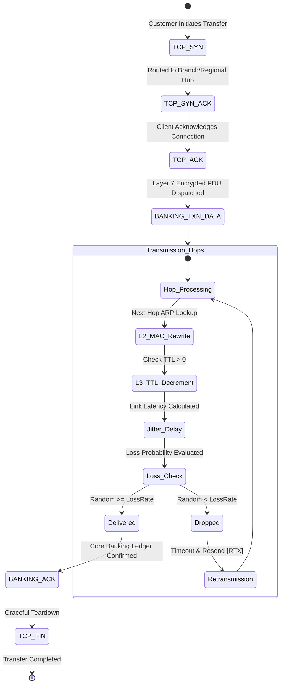

# NETBANKX — Discrete-Event Network Simulation & TCP Reliability Engine

## 1. Simulation Objectives

The NETBANKX simulation engine translates abstract high-level banking operations into physical and transport-layer network events. It allows computer science students and examiners to inspect:
1. Connection establishment via TCP 3-Way Handshake.
2. Layer 2 Frame encapsulation & MAC address rewriting across router hops.
3. Layer 3 IPv4 TTL decrementing and loop prevention.
4. Transport Layer (TCP) sequence numbers, acknowledgement numbers, and selective retransmission upon packet loss.
5. Application Layer TLS payload encryption and double-entry ledger execution.

---

## 2. Discrete Packet Flow Lifecycle

---

## 3. TCP Reliability & Loss Model

### Mathematical Loss Formulation
For each packet traversing a link $e = (u, v)$ with link loss rate $p_e \in [0, 1]$:
$$\text{Dropped} = \begin{cases} \text{true}, & \text{if } \text{random}(0, 1) < p_e \\ \text{false}, & \text{otherwise} \end{cases}$$

### Educational Retransmission Algorithm
When a packet drop occurs:
1. The simulator increments the connection's `packetsLost` counter.
2. An event `PACKET_LOSS` is broadcast over WebSockets, displaying a red pulse on the SVG topology.
3. The simulator pauses for a simulated Retransmission Timeout ($\text{RTO} = 2 \times \text{RTT}$).
4. The packet is resent with flag `[RTX]` and same sequence number:
   $$\text{Seq}_{\text{RTX}} = \text{Seq}_{\text{Original}}$$
5. The `retransmissions` metric is incremented.

---

## 4. Layer 2 / Layer 3 Transformations Per Hop

As a packet transitions from node $N_i$ to $N_{i+1}$:
1. **Layer 2 (Data Link):**
   - Source MAC is rewritten to $N_i.\text{macAddress}$.
   - Destination MAC is rewritten to $N_{i+1}.\text{macAddress}$.
2. **Layer 3 (Network):**
   - Source IP ($10.x.x.x$) and Destination IP ($10.y.y.y$) remain unchanged (End-to-End).
   - $\text{TTL} \leftarrow \text{TTL} - 1$. If $\text{TTL} \le 0$, the packet is discarded and an ICMP Time Exceeded event is triggered.
